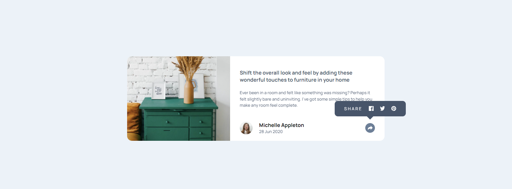

# Frontend Mentor - Article preview component solution

This is a solution to the [Article preview component challenge on Frontend Mentor](https://www.frontendmentor.io/challenges/article-preview-component-dYBN_pYFT). Frontend Mentor challenges help you improve your coding skills by building realistic projects.

## Table of contents

- [Overview](#overview)
  - [The challenge](#the-challenge)
  - [Links](#links)
  - [Built with](#built-with)
- [Author](#author)

## Overview

### The challenge

Users should be able to:

- View the optimal layout for the component depending on their device's screen size
- See the social media share links when they click the share icon

### Links

- Solution URL: [Add solution URL here](https://github.com/lulzz/frontmentor-preview-card/settings/pages)
- Live Site URL: [Add live site URL here](https://lulzz.github.io/frontmentor-preview-card/)

### Built with

- Semantic HTML5 markup
- CSS custom properties
- CSS Grid
- Mobile-first workflow
- Typescript

## Author

- Frontend Mentor - [@lulzz](https://www.frontendmentor.io/profile/lulzz)
